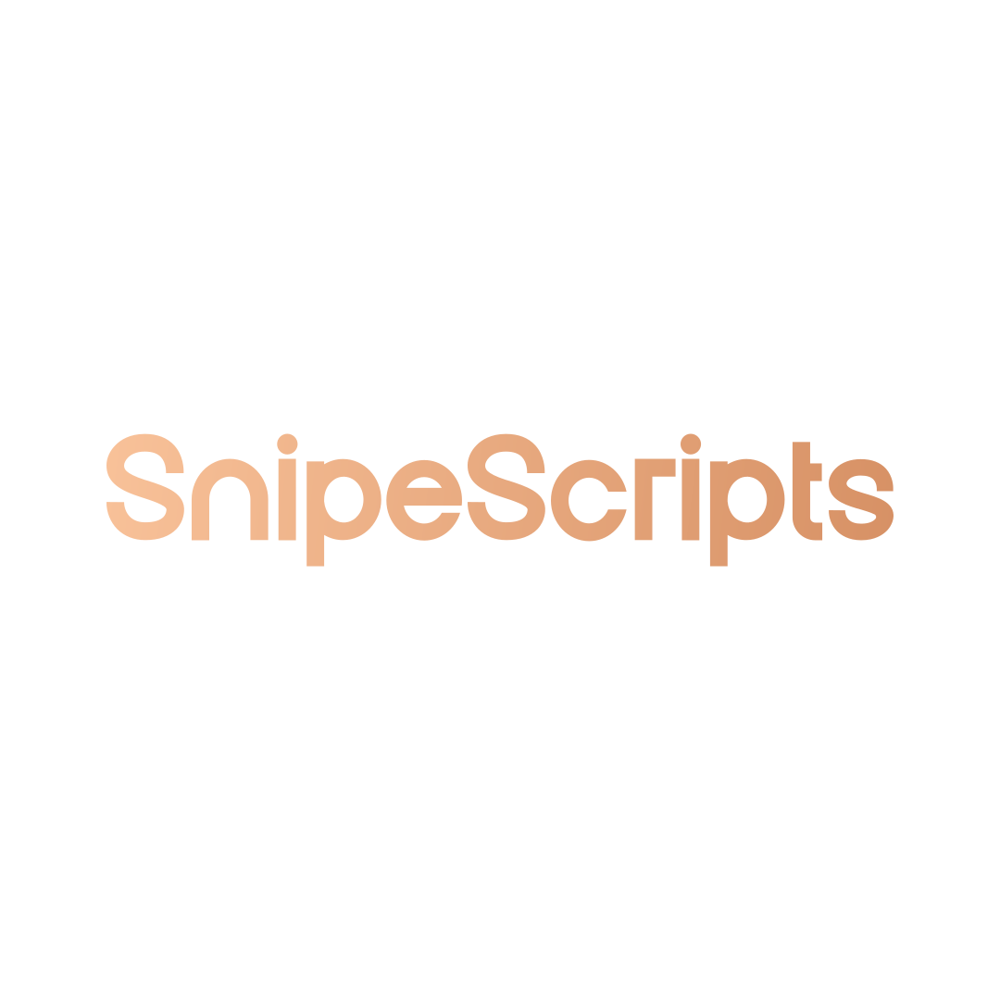

---
hide:
  - navigation
  - toc
---

# SnipeScripts

Premium FiveM Scripts

[:fontawesome-solid-cart-shopping: &nbsp;Tebex Store](https://snipe.tebex.io){.md-button .md-button--primary}
[:fontawesome-brands-discord: &nbsp;Discord](https://discord.gg/AeCVP2F8h7){.md-button}

<h2 class="ss-section-title">Documentation</h2>

Pick a script to get started.

### :material-cash-multiple: Business & Money

-   :material-silverware-fork-knife:{ .lg } &nbsp; **Restaurants**

    ---

    Custom restaurant ordering, kitchen flow, and customer experience.

    [:octicons-arrow-right-24: Open](restaurants.md)

-   :material-bank:{ .lg } &nbsp; **Banking**

    ---

    Accounts, transfers, loans — full banking experience.

    [:octicons-arrow-right-24: Open](banking.md)

-   :material-store:{ .lg } &nbsp; **Owned Shops**

    ---

    Player-owned shops with stock and pricing controls.

    [:octicons-arrow-right-24: Open](ownedshops.md)

-   :material-receipt-text:{ .lg } &nbsp; **Invoices**

    ---

    Send and pay invoices between players and businesses.

    [:octicons-arrow-right-24: Open](invoices.md)

-   :material-gift:{ .lg } &nbsp; **Donator System**

    ---

    Reward donors with tiers, perks, and benefits.

    [:octicons-arrow-right-24: Open](donatorsystem.md)

-   :material-briefcase-account:{ .lg } &nbsp; **Multi Job**

    ---

    Let players hold and switch between multiple jobs.

    [:octicons-arrow-right-24: Open](multijob.md)

### :material-flask: Crafting & Production

-   :material-hammer-wrench:{ .lg } &nbsp; **Crafting**

    ---

    Recipe-based crafting with skill progression.

    [:octicons-arrow-right-24: Open](crafting.md)

-   :material-bee:{ .lg } &nbsp; **Beekeeping**

    ---

    Manage hives, harvest honey, sell to vendors.

    [:octicons-arrow-right-24: Open](beekeeping.md)

-   :material-flask-outline:{ .lg } &nbsp; **Meth**

    ---

    Cook, package, and distribute methamphetamine.

    [:octicons-arrow-right-24: Open](meth.md)

-   :material-bottle-tonic:{ .lg } &nbsp; **Moonshine**

    ---

    Distill, age, and bottle moonshine for sale.

    [:octicons-arrow-right-24: Open](moonshine.md)

-   :material-glass-wine:{ .lg } &nbsp; **Winery**

    ---

    Grow grapes, ferment wine, run a winery business.

    [:octicons-arrow-right-24: Open](winery.md)

-   :material-printer:{ .lg } &nbsp; **Printer**

    ---

    Hacking-style money printer with risk and rewards.

    [:octicons-arrow-right-24: Open](printer.md)

### :material-shield-account: Police & Admin

-   :material-shield-crown:{ .lg } &nbsp; **Admin Menu**

    ---

    Powerful admin tools for managing your server.

    [:octicons-arrow-right-24: Open](adminmenu.md)

-   :material-fingerprint:{ .lg } &nbsp; **Evidence System**

    ---

    Collect, log, and process criminal evidence.

    [:octicons-arrow-right-24: Open](evidence.md)

-   :material-cctv:{ .lg } &nbsp; **Police Cams**

    ---

    Live security camera viewing for law enforcement.

    [:octicons-arrow-right-24: Open](policecams.md)

### :material-home-variant: Lifestyle & Misc

-   :material-bed:{ .lg } &nbsp; **Motel**

    ---

    Rentable motel rooms with stash and customization.

    [:octicons-arrow-right-24: Open](motel.md)

-   :material-sofa:{ .lg } &nbsp; **Furniture Stash**

    ---

    Store items in placeable furniture around the map.

    [:octicons-arrow-right-24: Open](furniturestash.md)

-   :material-snowflake:{ .lg } &nbsp; **Icebox**

    ---

    Cold storage for perishables and stashed goods.

    [:octicons-arrow-right-24: Open](icebox.md)

-   :material-face-woman:{ .lg } &nbsp; **Wigs**

    ---

    Disguise system using wigs and hairstyles.

    [:octicons-arrow-right-24: Open](wigs.md)

-   :material-map-marker-radius:{ .lg } &nbsp; **Blips**

    ---

    Custom map blips for jobs, shops, and locations.

    [:octicons-arrow-right-24: Open](blips.md)

